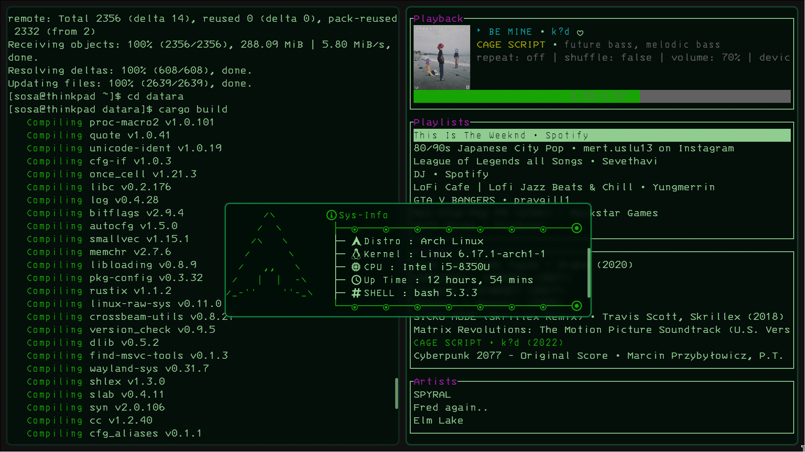
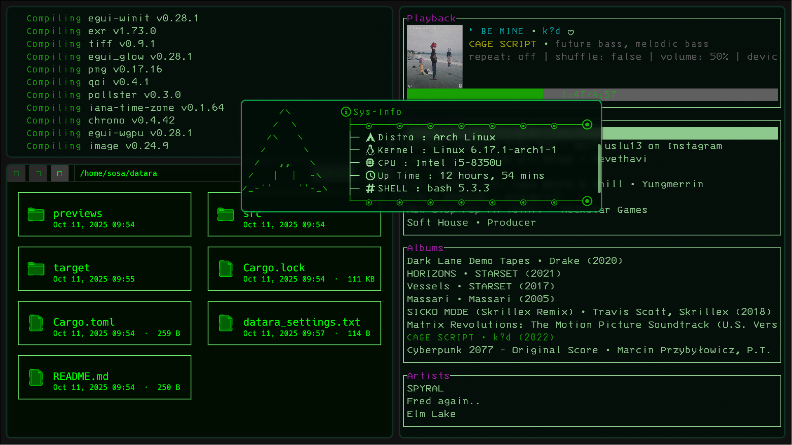
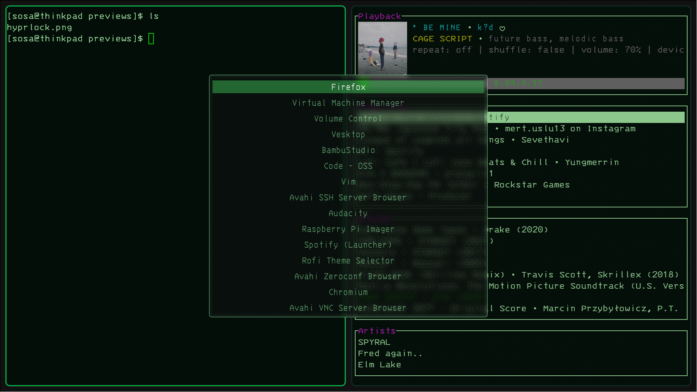
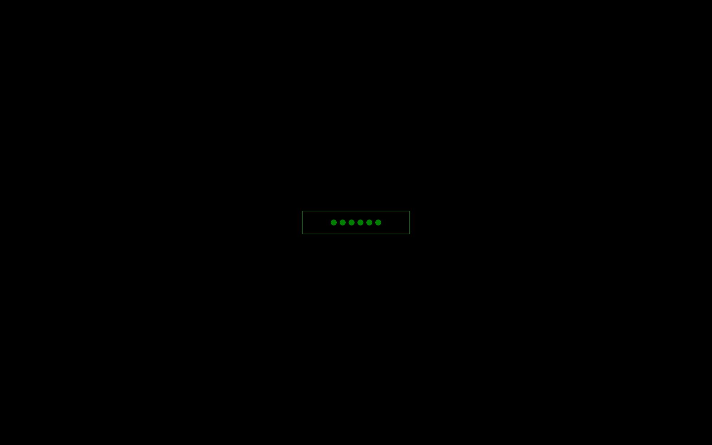

# Minimal Hyprland Theme & Configs

A clean, dark, **Hyprland** setup for Wayland users.  
With modern Linux tools like **Kitty**, **Rofi**, **Hyprlock**, and **Neovim (Lazy)**.  

WARNING > Three things you have to set up yourself. the monitors setup in the hyprland.conf and the font size in kitty.conf, and the keyboard layout also in hyprland.conf

---

## 🖼️ Screenshots

| Desktop 1 | Desktop 2 |
|:----------:|:----------:|
|  |  |

| Rofi Menu | Hyprlock |
|:----------:|:----------:|
|  |  |

---

## ⚙️ Requirements

You need a **Wayland compositor** with **Hyprland** and its essentials.

### 🧱 Required packages (Arch Linux)

```bash
sudo pacman -S --needed hyprland waybar rofi-wayland hyprlock hyprshot kitty neovim \
xdg-desktop-portal-hyprland wl-clipboard grim slurp wget unzip git curl ripgrep fd
```

*(For Debian/Ubuntu users, equivalent packages exist — but this setup is built and tested for Arch.)*

---

## 🧩 Installing the Nerd Font

This theme uses **IBM 3270 Nerd Font** for its retro-tech look.  
Run these commands to download, install, and cache it:

```bash
wget https://github.com/ryanoasis/nerd-fonts/releases/download/v3.4.0/3270.zip -O /tmp/3270.zip && \
mkdir -p ~/.local/share/fonts/NerdFonts && \
unzip -o /tmp/3270.zip -d ~/.local/share/fonts/NerdFonts && \
fc-cache -fv
```

To verify:
```bash
fc-list | grep 3270
```

---

## 🎨 Installing the Theme

Clone this repository and copy the configs to your user config folder:

```bash
git clone https://github.com/YOUR_USERNAME/Matrix-Minimal-Hyprland.git
cd Matrix-Minimal-Hyprland
cp -r * ~/.config/
```

Now log out and start **Hyprland** again to apply everything.  
You’ll get the Matrix-style blur, neon borders, and transparent Rofi menu.

---

## 🧠 Optional: CLI Spotify Experience

To complement the minimalist theme, you can add a terminal Spotify setup:

```bash
yay -S spotifyd spotify-player
```

Then run:
```bash
spotify_player
```

This gives you a **clean command-line Spotify interface** that fits perfectly with the retro-terminal aesthetic.

---

## 🧮 Setting up Neovim (with Lazy)

If you want to extend this theme into **Neovim** for coding or writing, follow these steps 👇  

### 1️⃣ Install Neovim
```bash
sudo pacman -S neovim git
```

### 2️⃣ Create configuration folders
```bash
mkdir -p ~/.config/nvim/lua
```

### 3️⃣ Install Lazy.nvim
```bash
git clone https://github.com/folke/lazy.nvim ~/.local/share/nvim/lazy/lazy.nvim
```

### 4️⃣ Create your `~/.config/nvim/init.lua`
```lua
vim.g.mapleader = " "
vim.opt.termguicolors = true
vim.opt.number = true
vim.opt.relativenumber = true

-- Lazy setup
local lazypath = vim.fn.stdpath("data") .. "/lazy/lazy.nvim"
vim.opt.rtp:prepend(lazypath)

require("lazy").setup({
  { "Everblush/nvim", name = "everblush", lazy = false, priority = 1000 },
  { "nvim-tree/nvim-tree.lua", dependencies = { "nvim-tree/nvim-web-devicons" } },
})

vim.cmd.colorscheme("everblush")

-- Follow terminal background
vim.api.nvim_create_autocmd("ColorScheme", {
  callback = function()
    for _, g in ipairs({ "Normal", "NormalNC", "NormalFloat", "SignColumn", "LineNr", "EndOfBuffer" }) do
      vim.cmd(("hi %s guibg=NONE ctermbg=NONE"):format(g))
    end
  end,
})
```

### 5️⃣ Run Neovim
```bash
nvim
```

Lazy.nvim will automatically install and set up everything on the first launch.

---

## ✅ Finishing Up

Once everything is installed:
- Fonts are cached
- Configs are copied
- Neovim is set up
- Spotify CLI is ready

Reboot or restart your Hyprland session to enjoy your **Matrix Minimal Desktop** 💚
